# Arthur Bot — 24/7 AI Discord 社群自動化管理系統

> **An autonomous, AI-powered Discord community manager for overseas real estate investment communities.**  
> 零 npm 依賴 · 免費 Gemini API · $0/月運行成本 · WSL2 Ubuntu 部署

---

## 目錄 / Table of Contents

- [系統概覽 / Overview](#系統概覽--overview)
- [執行環境 / Environment](#執行環境--environment)
- [系統架構 / Architecture](#系統架構--architecture)
- [腳本說明 / Scripts](#腳本說明--scripts)
- [排程任務 / Scheduled Tasks](#排程任務--scheduled-tasks)
- [常駐服務 / Persistent Services](#常駐服務--persistent-services)
- [資料流程 / Data Flow](#資料流程--data-flow)
- [自癒系統 / Self-Heal System](#自癒系統--self-heal-system)
- [遠端控制 / Remote Control](#遠端控制--remote-control)
- [頻道結構 / Channel Structure](#頻道結構--channel-structure)
- [操作說明 / Usage Guide](#操作說明--usage-guide)
- [可實現應用場景 / Use Cases](#可實現應用場景--use-cases)

---

## 系統概覽 / Overview

**Arthur Bot** 是一套完全自動化的 Discord 社群管理 AI，專為海外置產社群打造。系統以 **Google Gemini Flash** 作為語言模型，透過 Discord Webhook 與 Bot API 實現全天候自動互動、內容發布、成員管理與系統自癒。

**Arthur Bot** is a fully autonomous Discord community AI built for overseas real estate investment communities. Powered by **Google Gemini Flash**, it delivers 24/7 automated engagement, content publishing, member profiling, and self-healing system management.

### 核心特性 / Key Features

| 特性 | 說明 |
|------|------|
| 🤖 **零人力值班** | 24/7 自動回覆、歡迎、發文，無需人工干預 |
| 💰 **零成本運行** | 使用 Gemini 免費 API，純 Node.js 內建模組，無付費依賴 |
| 🔧 **三層自癒機制** | 自動偵測問題 → Gemini 診斷 → Telegram 告警 |
| 📊 **成員記憶系統** | 自動建立每位成員的興趣與背景檔案 |
| 📡 **多平台遠端控制** | Telegram Bot + Discord #admin 頻道雙管道指令介面 |
| 🛡️ **Prompt 安全防護** | 防止角色竄改、資料洩漏、多語言繞過等 12 種攻擊向量 |

---

## 執行環境 / Environment

```
作業系統: Windows 10 + WSL2 Ubuntu (Linux 子系統)
執行環境: Node.js 20 LTS (via nvm)
排程系統: cron (WSL2 原生，非 systemd)
外部依賴: 零 npm 套件 (純 Node.js built-ins: https, fs, path, crypto)
AI 模型:  Google Gemini 2.5 Flash (免費 API)
```

```
OS: Windows 10 + WSL2 Ubuntu
Runtime: Node.js 20 LTS (via nvm)
Scheduler: cron (native WSL2, not systemd)
Dependencies: Zero npm packages (Node.js built-ins only)
AI Model: Google Gemini 2.5 Flash (free API tier)
```

### 目錄結構 / Directory Layout

```
$HOME/arthur-bot/
├── discord-lobster-master/   # 主程式 / Bot source
│   ├── lib/
│   │   ├── config.js         # 環境變數載入器
│   │   └── utils.js          # Discord API、Gemini、Webhook 工具
│   ├── data/                 # 執行期狀態 JSON (gitignored)
│   └── logs/                 # 各腳本獨立 log 檔
├── logs/                     # 常駐服務 log
└── pids/                     # PID 追蹤檔
```

---

## 系統架構 / Architecture

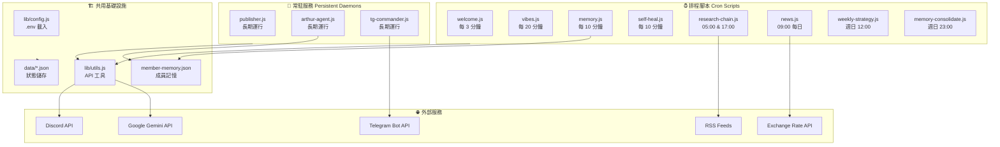

---

## 腳本說明 / Scripts

### 排程腳本 (Cron Scripts)

#### `welcome.js` — 新成員歡迎

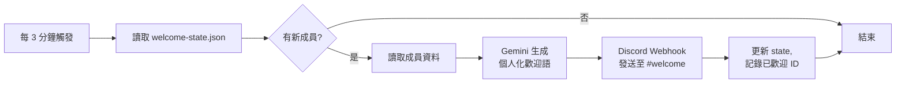

- 偵測 `#welcome` 頻道的新加入訊息，為每位成員生成**個人化**歡迎詞
- 避免重複歡迎（state 追蹤已處理 ID）

---

#### `vibes.js` — 社群氛圍互動

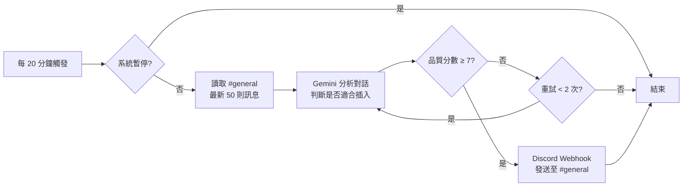

---

#### `memory.js` — 成員記憶建檔

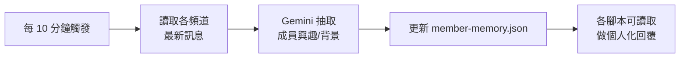

---

#### `self-heal.js` — 三層自癒哨兵

見 [自癒系統](#自癒系統--self-heal-system) 章節。

---

#### `research-chain.js` — 研究鏈

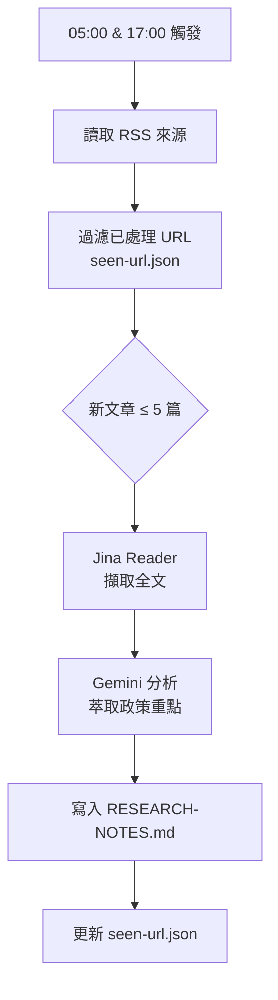

---

#### `news.js` — 每日市場情報

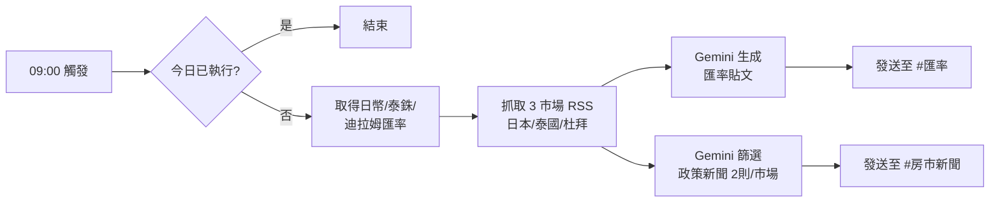

---

### 常駐服務 (Persistent Daemons)

#### `arthur-agent.js` — 深度 Q&A

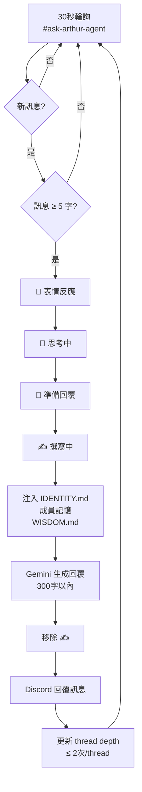

---

#### `publisher.js` — 發布引擎

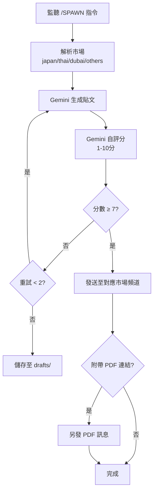

---

## 排程任務 / Scheduled Tasks

```mermaid
gantt
    title 每日排程時間軸 / Daily Schedule Timeline (UTC+8)
    dateFormat HH:mm
    axisFormat %H:%M

    section 高頻輪詢
    welcome.js (每3分)    :active, 00:00, 24:00
    memory.js (每10分)    :active, 00:00, 24:00
    self-heal.js (每10分) :active, 00:00, 24:00
    vibes.js (每20分)     :active, 00:00, 24:00

    section 定時任務
    Log 清理              :milestone, 00:05, 1m
    research-chain (早)   :milestone, 05:00, 30m
    news.js               :milestone, 09:00, 20m
    research-chain (晚)   :milestone, 17:00, 30m

    section 週日限定
    weekly-strategy.js    :crit, 12:00, 60m
    memory-consolidate.js :crit, 23:00, 30m
```

| 腳本 | 頻率 | 時間 | RPD 消耗 |
|------|------|------|----------|
| `welcome.js` | 每 3 分鐘 | 全天 | ~0-5/天 |
| `vibes.js` | 每 20 分鐘 | 全天 | ~72/天 |
| `memory.js` | 每 10 分鐘 | 全天 | ~144/天 |
| `self-heal.js` | 每 10 分鐘 | 全天 | 僅告警時 |
| `research-chain.js` | 2x/天 | 05:00, 17:00 | ~10/天 |
| `news.js` | 每日 | 09:00 | ~2/天 |
| `weekly-strategy.js` | 週日 | 12:00 | ~5/週 |
| `memory-consolidate.js` | 週日 | 23:00 | ~3/週 |

> **RPD 目標**: 免費 Key ≤ 125/天（免費上限 1,500 RPD 的 8.3%）

---

## 常駐服務 / Persistent Services

### 啟動管理

```bash
# 啟動所有服務
bash ~/arthur-bot/setup/start-persistent.sh start

# 查看狀態
bash ~/arthur-bot/setup/start-persistent.sh status

# 重啟（強制清除孤兒進程）
bash ~/arthur-bot/setup/start-persistent.sh restart

# 停止
bash ~/arthur-bot/setup/start-persistent.sh stop
```

### 進程管理流程

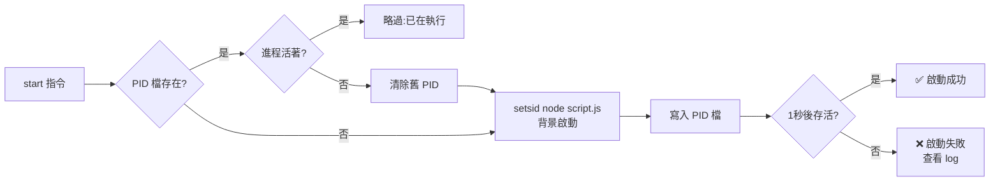

---

## 資料流程 / Data Flow

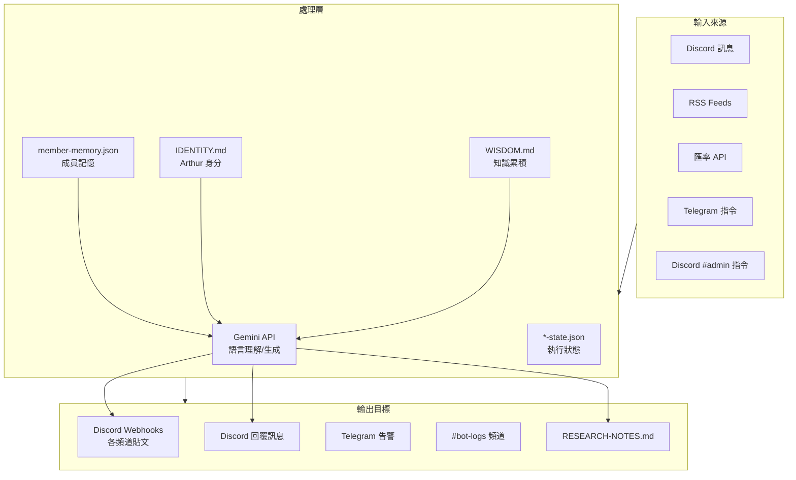

---

## 自癒系統 / Self-Heal System

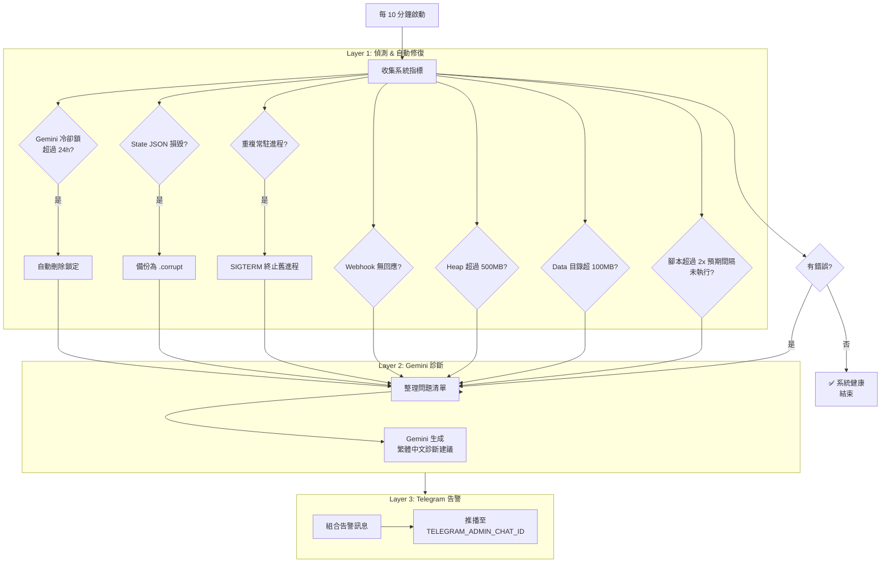

### 偵測項目 / Detection Items

| # | 項目 | 自動修復 | 告警 |
|---|------|---------|------|
| 1 | Gemini 冷卻鎖過期（>24h） | ✅ 自動刪除 | ✅ |
| 2 | Webhook HEAD 請求失敗 | ❌ | ✅ |
| 3 | Heap 記憶體 > 500MB | ❌ | ✅ |
| 4 | Data 目錄 > 100MB | ❌ | ✅ |
| 5 | State JSON 損毀 | ✅ 備份 .corrupt | ✅ |
| 6 | 腳本超過 2× 間隔未執行 | ❌ | ✅ |
| 7 | 重複常駐進程 | ✅ SIGTERM 舊進程 | ✅ |

---

## 遠端控制 / Remote Control

### 雙管道控制介面

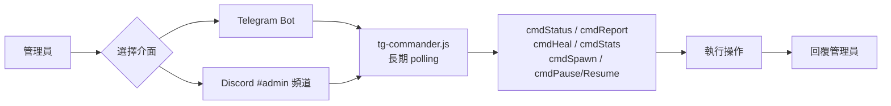

### Telegram 指令

| 指令 | 說明 |
|------|------|
| `/status` | 各腳本最後執行時間 |
| `/stats` | 成員數、互動次數統計 |
| `/report` | 今日 RPD API 用量 |
| `/heal` | 自癒系統最後健康報告 |
| `/spawn <市場> <內容>` | 手動觸發發布任務 |
| `/pause` | 暫停所有腳本 |
| `/resume` | 恢復腳本執行 |
| `/help` | 顯示所有指令 |

### Discord #admin 指令

| 指令 | 說明 |
|------|------|
| `!status` | 各腳本最後執行時間 |
| `!report` | 今日 RPD 用量 |
| `!heal` | 健康檢查報告 |
| `!stats` | 成員與互動統計 |
| `!restart` | 重啟所有常駐服務 |
| `!help` | 顯示說明 |

---

## 頻道結構 / Channel Structure

```
Discord 伺服器
├── 📢 公告類
│   ├── #welcome          ← welcome.js 歡迎新成員
│   └── #announcements
│
├── 💬 社群互動
│   ├── #general          ← vibes.js 參與對話
│   └── #ask-arthur-agent ← arthur-agent.js 深度 Q&A
│
├── 📊 市場情報
│   ├── #匯率             ← news.js 每日匯率
│   ├── #房市新聞          ← news.js 政策新聞
│   ├── #japan            ← publisher.js 日本市場
│   ├── #thailand         ← publisher.js 泰國市場
│   ├── #dubai            ← publisher.js 杜拜市場
│   └── #others           ← publisher.js 其他市場
│
└── 🔧 系統管理
    ├── #bot-logs         ← utils.js 系統 log 轉發
    └── #admin            ← tg-commander.js 管理指令
```

---

## 操作說明 / Usage Guide

### 每日監控

```bash
# 查看各服務狀態
bash ~/arthur-bot/setup/start-persistent.sh status

# 查看 arthur-agent 運作
tail -f ~/arthur-bot/logs/arthur-agent.log

# 查看 self-heal 報告
tail -20 ~/arthur-bot/discord-lobster-master/logs/self-heal.log

# 查看今日 API 用量
cat ~/arthur-bot/discord-lobster-master/data/rpd-counter.json
```

### 手動觸發

```bash
# 手動執行新聞腳本
node ~/arthur-bot/discord-lobster-master/news.js

# 手動執行研究鏈
node ~/arthur-bot/discord-lobster-master/research-chain.js

# 手動健康檢查
node ~/arthur-bot/discord-lobster-master/self-heal.js
```

### 遠端指令（Telegram 或 Discord #admin）

```
/status   — 確認各腳本運作時間
/report   — 確認 API 用量不超標
/heal     — 查看最後健康檢查
/stats    — 看社群互動數據
!restart  — 重啟所有服務（Discord #admin）
```

### 暫停與恢復

```bash
# 緊急暫停所有 AI 回應
touch ~/arthur-bot/discord-lobster-master/data/pause.lock

# 恢復
rm ~/arthur-bot/discord-lobster-master/data/pause.lock
```

---

## 可實現應用場景 / Use Cases

### 已實現場景

| 場景 | 實現腳本 | 說明 |
|------|----------|------|
| 🏠 海外置產社群自動化 | 全套系統 | 本案主要用途 |
| 🌍 多市場（日本/泰國/杜拜）內容分發 | publisher.js | 自動分頻道發布 |
| 📈 每日匯率與房市新聞 | news.js | 三幣種匯率 + 政策篩選 |
| 🤖 24/7 AI 客服問答 | arthur-agent.js | 房地產知識問答 |
| 👋 個人化新成員歡迎 | welcome.js | 依成員背景客製化 |
| 📚 自動研究報告生成 | research-chain.js | RSS → AI 摘要 |
| 🧠 成員興趣建檔 | memory.js | 累積社群知識 |

### 可延伸應用場景

| 場景 | 需調整項目 |
|------|-----------|
| 📦 電商社群管理 | 調整 IDENTITY.md 與 prompt 主題 |
| 💹 股票/加密貨幣社群 | 替換 RSS 來源與匯率 API |
| 🎓 教育/學習社群 | 調整 vibes.js 互動風格 |
| 🏥 醫療/健康社群 | 加強 prompt 安全限制 |
| 🌐 多語言社群 | 修改 prompt 語言設定 |
| 📰 新聞媒體社群 | 擴增 RSS 來源數量 |

---

## 技術規格 / Technical Specs

| 項目 | 規格 |
|------|------|
| **語言** | Node.js (CommonJS) |
| **外部依賴** | 零 npm 套件 |
| **AI 模型** | Gemini 2.5 Flash |
| **API 免費上限** | 1,500 RPD / 天 |
| **目標用量** | ≤ 125 RPD / 天 |
| **Thread 上限** | 每 thread 最多 2 回覆 |
| **State 保留** | 滾動 300 筆 |
| **Self-heal 指標** | 滾動 144 筆（24h） |
| **Log 輪替** | 7 天 |

---

## 授權 / License

MIT License — 本專案基於 [discord-lobster](https://github.com/lobster) 擴展開發。

---

*由 Arthur Bot 驅動 · Powered by Arthur Bot*  
*Google Gemini Flash · Discord API · Pure Node.js*
